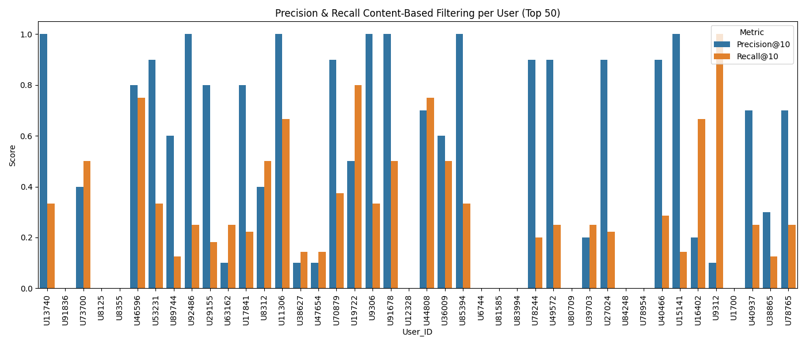
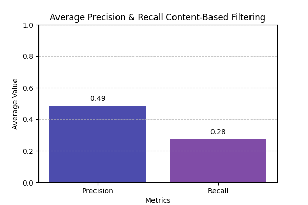

### Laporan Proyek Machine Learning - Atifa Fiorenza

### Domain Proyek
Dalam era digital, konsumsi berita secara daring mengalami peningkatan yang signifikan. Salah satu tantangan utama bagi platform berita adalah bagaimana menyajikan artikel yang relevan dan sesuai minat pembaca agar keterlibatan (engagement) tetap tinggi. Rekomendasi berita yang tidak sesuai dapat menyebabkan pembaca kehilangan minat dan beralih ke platform lain.

Untuk mengatasi hal tersebut, penelitian di bidang news recommendation system banyak memanfaatkan teknik machine learning serta natural language processing (NLP). Model rekomendasi memungkinkan prediksi preferensi pengguna berdasarkan riwayat interaksi sebelumnya, baik berupa klik, bacaan, maupun kategori berita yang sering diakses. Dengan demikian, sistem dapat memberikan rekomendasi yang lebih personal, cepat, dan adaptif.

Dataset MIND (Microsoft News Dataset) merupakan salah satu benchmark publik yang banyak digunakan dalam penelitian news recommendation. Dataset ini dikembangkan oleh Microsoft Research dan terdiri dari dua bagian utama: informasi berita (judul, abstrak, kategori, sub-kategori) serta log perilaku pengguna (riwayat klik dan impresi). Dengan memanfaatkan dataset ini, kita dapat membangun model rekomendasi berita yang mempertimbangkan konten artikel serta pola interaksi pengguna.

Proyek ini berfokus pada pengembangan sistem rekomendasi berita berbasis konten (content-based filtering) dan kolaboratif (collaborative filtering), serta mengevaluasi performa menggunakan metrik seperti Precision@K dan Recall@K. Diharapkan, sistem yang dibangun mampu membantu meningkatkan relevansi rekomendasi berita, sehingga pengalaman pengguna menjadi lebih baik dan keterlibatan terhadap platform berita semakin tinggi.

Referensi:
Wu, C., Wu, F., Qi, T., Huang, Y., & Xie, X. (2020). MIND: A Large-scale Dataset for News Recommendation. Proceedings of the 58th Annual Meeting of the Association for Computational Linguistics (ACL), 3597–3606. https://doi.org/10.18653/v1/2020.acl-main.331

----

### Business Understanding
Menyajikan berita yang relevan dan personal bagi pengguna merupakan tantangan utama platform berita daring. Rekomendasi yang tidak sesuai minat berpotensi menurunkan keterlibatan pengguna dan membuat mereka beralih ke platform lain.
Bagi pengguna, sistem rekomendasi yang tepat membantu menemukan berita yang sesuai dengan preferensi secara cepat di tengah banyaknya informasi yang tersedia.
Dengan pendekatan Content-Based Filtering (CBF), sistem rekomendasi dapat dibangun berdasarkan kesamaan konten artikel berita (judul, abstrak, kategori), sehingga rekomendasi yang diberikan tetap relevan meski hanya bergantung pada informasi artikel yang pernah diklik pengguna sebelumnya.

##### Problem Statements
1. Bagaimana cara merepresentasikan konten berita (judul dan abstrak) sehingga dapat digunakan untuk mengukur kemiripan antarartikel?
2. Bagaimana membangun sistem rekomendasi berita berbasis content-based filtering agar dapat memberikan artikel yang mirip dengan riwayat bacaan pengguna?
3. Seberapa relevan rekomendasi yang dihasilkan model content-based filtering dibandingkan dengan riwayat klik aktual pengguna?

##### Goals
1. Mengolah data teks berita (judul dan abstrak) menjadi representasi numerik menggunakan teknik seperti TF-IDF.
2. Membangun sistem rekomendasi berita berbasis kemiripan konten yang dapat memberikan top-N artikel untuk setiap pengguna.
3. Mengevaluasi performa sistem rekomendasi menggunakan metrik Precision@K dan Recall@K.

##### Solution Statement
1. Melakukan pra-pemrosesan teks (tokenisasi, stopword removal, normalisasi) pada judul dan abstrak berita.
2. Membangun representasi berita menggunakan TF-IDF, kemudian menemukan artikel-artikel terdekat dengan pendekatan Nearest Neighbors berbasis jarak cosine.
3. Mengembangkan sistem rekomendasi berbasis content-based filtering untuk menyarankan artikel mirip dengan yang pernah diklik pengguna, serta mengevaluasi hasilnya dengan Precision@K dan Recall@K.

---

### Data Understanding
Dataset yang digunakan dalam proyek ini adalah **MIND: Microsoft News Recommendation Dataset** yang tersedia di Kaggle, bersumber dari *UCI Machine Learning Repository*. Dataset ini dapat diakses melalui tautan berikut: [https://www.kaggle.com/datasets/arashnic/mind-news-dataset/data](https://www.kaggle.com/datasets/arashnic/mind-news-dataset/data).

Dataset ini disediakan dalam bentuk folder terkompresi (.zip) yang terdiri dari empat file utama namun yang digunakan hanya file behaviors.tsv dan news.tsv dimana file news memiliki data sebesar 51282 dengan 8 kolom sedangkan file behaviors 156965 data dengan 5 kolom.

Berikut isi filenya : 
**behaviors.tsv** → berisi log impresi dan riwayat klik pengguna. Terdiri dari 5 kolom:
  * `Impression ID`: ID unik untuk setiap impresi.
  * `User ID`: ID anonim pengguna.
  * `Time`: Waktu impresi dengan format "MM/DD/YYYY HH:MM:SS AM/PM".
  * `History`: Daftar berita yang pernah diklik oleh pengguna sebelumnya (urut berdasarkan waktu).
  * `Impressions`: Daftar berita yang ditampilkan dalam impresi tersebut, beserta label klik (1 = diklik, 0 = tidak diklik).

**news.tsv** → berisi informasi detail dari setiap artikel berita. Terdiri dari 7 kolom:
  * `News ID`: Identifier unik artikel berita.
  * `Category`: Kategori utama berita (misalnya news, sports, entertainment).
  * `SubCategory`: Subkategori berita (misalnya football, movie).
  * `Title`: Judul artikel berita.
  * `Abstract`: Ringkasan artikel berita.
  * `URL`: Tautan ke artikel asli.
  * `Title Entities dan Abstract Entities`: Entitas (misalnya tokoh, tempat, organisasi) yang disebutkan dalam judul atau abstrak.

**entity_embedding.vec** → representasi vektor (embedding) untuk entitas yang diekstrak dari knowledge graph.
**relation_embedding.vec** → representasi vektor (embedding) untuk hubungan antar entitas.

### Hasil Pengecekan Data
**News**
- Missing values: ditemukan pada kolom *Abstract* (2666 baris), *Title_Entities* (3 baris), dan *Abstract_Entities* (4 baris).  
- Duplikasi: tidak ditemukan nilai duplikat.  

**Behaviors**
- Missing values: ditemukan pada kolom *History* (3238 baris).  
- Duplikasi: tidak ditemukan nilai duplikat.  

---
### Data Visualization 

#### Univariate Analysis

Berdasarkan hasil distribusi dataset sangat didominasi oleh berita news dan sports, dengan subkategori newsus dan football_nfl paling banyak. Ketidakseimbangan distribusi ini penting untuk diperhatikan karena bisa membuat model klasifikasi nanti lebih condong ke kategori mayoritas

Title cenderung singkat dengan rata-rata 10 kata. Abstract lebih bervariasi (mean 34, median 24) karena ada beberapa yang sangat panjang. Untuk entitas, judul rata-rata memuat 1 entitas, sedangkan abstrak lebih kaya (mean 1.9, median 1). Distribusinya miring ke kanan, artinya mayoritas teks hanya punya sedikit entitas, tapi ada outlier dengan jumlah jauh lebih banyak.

#### Multivariate Analysis

Grafik menunjukkan judul umumnya singkat (±10–15 kata), sedangkan abstrak lebih bervariasi tapi terkonsentrasi di 50–150 kata. Karena judul ringkas dan abstrak lebih informatif, menggabungkan keduanya adalah strategi terbaik agar model rekomendasi memahami artikel secara lebih lengkap.

Grafik menunjukkan tidak ada hubungan langsung antara entitas di judul dan abstrak. Judul umumnya hanya memuat 0–3 entitas, sedangkan abstrak jauh lebih bervariasi (0–30 entitas), sehingga abstrak cenderung lebih kaya informasi.

Distribusi Panjang Judul (Title_length) per Kategori
* Kategori TV dan News cenderung memiliki judul yang lebih panjang dibanding kategori lain, terlihat dari median dan beberapa outlier yang cukup tinggi.
* Kategori seperti Kids, Middle East, dan North America cenderung memiliki judul paling pendek.

Distribusi Panjang Abstrak (Abstract_length) per Kategori
* Kategori Movies, Weather, dan News memiliki abstrak yang lebih panjang secara umum, dengan beberapa outlier ekstrem.
* Kategori Kids, Middle East, dan North America tetap cenderung memiliki abstrak paling pendek.

* Jumlah entitas bisa menjadi indikator untuk membedakan kategori.
* Artikel berita dan olahraga memiliki jumlah entitas yang jauh lebih beragam dan tinggi dibanding kategori hiburan.
* Kategori Middle East secara konsisten kaya entitas, baik di judul maupun abstrak.
* Sebaliknya, kategori hiburan (Movies, Music, Lifestyle, Kids) cenderung miskin entitas.

Visualisasi pairplot menunjukkan bahwa judul umumnya singkat (5–15 kata) dengan entitas 0–2, sedangkan abstrak lebih panjang (hingga >200 kata) dan kaya entitas (bisa >20). Terdapat korelasi positif antara panjang abstrak dan jumlah entitas, serta hubungan lemah antara panjang judul dan abstrak. Secara keseluruhan, abstrak lebih representatif dalam memuat informasi dibandingkan judul.

### Data Preparation
Pada tahap ini, beberapa teknik persiapan data dilakukan untuk memastikan data siap digunakan dalam pemodelan:

1. **Copy Data** : Menyimpan news ke dalam **news_clean** dan behaviors ke dalam **behaviors_clean**
2. **Menghilangkan Nilai Null dan Duplikat**: Membersihkan dataset dari nilai kosong dan baris duplikat untuk mengurangi bias serta menjaga kualitas data.
3.  **Tabel Behaviors User***: Berisi interaksi pengguna dengan berita (misalnya klik atau tidak). Tabel ini berfungsi sebagai label perilaku pengguna dalam evaluasi sistem rekomendasi, sehingga model dapat menilai relevansi prediksi dengan preferensi nyata pengguna.
4. **Kolom Full Text**: Kolom title dan abstract digabung menjadi kolom baru Full_Text. Tujuannya agar model menangkap kata kunci dan konteks artikel dengan lebih kaya.
5. **Pra-pemrosesan Teks**: Membersihkan teks pada kolom Full_Text (misalnya case folding, stopword removal, normalisasi, lemmatization) yang disimpan ke dalam cleaned text agar siap digunakan untuk analisis.
6. **Representasi Teks ke Vektor**: Mengubah teks bersih di kolom Cleaned_Text menjadi representasi numerik (misalnya `TF-IDF` atau word embeddings) agar bisa diproses oleh model pembelajaran mesin. Pada tahap ini digunakan `min_df=5` untuk mengabaikan kata yang terlalu jarang muncul (kurang dari 5 dokumen) dan `stop_words= english` untuk membuang kata umum yang tidak informatif, sehingga hanya kata yang relevan yang dipakai model.

-----

### Modeling
Pada tahap ini, sistem rekomendasi dibangun menggunakan `Content-Based Filtering (CBF)` dengan algoritma Nearest Neighbors. Model ini dipilih karena sederhana, intuitif, dan efektif untuk mencari artikel yang paling mirip berdasarkan representasi vektor teks (TF-IDF).

**Nearest Neighbors** :  Algoritma ini bekerja dengan mencari sejumlah dokumen yang paling dekat (tetangga terdekat) terhadap sebuah dokumen target berdasarkan ukuran kesamaan tertentu. Dalam kasus ini digunakan cosine similarity, karena cocok untuk mengukur kemiripan antar vektor TF-IDF.
  * Keunggulan:
    - Sederhana dan mudah diimplementasikan.
    - Cocok untuk content-based recommendation karena memanfaatkan informasi isi artikel (judul + abstrak).
    - Tidak memerlukan data interaksi pengguna yang banyak, cukup mengandalkan konten.
    Parameter yang Digunakan:

    **NearestNeighbors(metric='cosine', algorithm='brute', n_neighbors=11)**

    - `metric='cosine'`: Mengukur kesamaan antar artikel berdasarkan sudut kosinus antar vektor TF-IDF.
    - `algorithm='brute'`: Melakukan pencarian jarak secara langsung, cocok untuk dataset ukuran sedang.
    - `n_neighbors=11`: Mengambil 10 rekomendasi artikel mirip, ditambah 1 artikel itu sendiri (total 11).

Dengan model ini, sistem dapat merekomendasikan artikel yang paling mirip secara konten dengan artikel yang baru saja dibaca pengguna.

-----

### Evaluation
Tahap ini bertujuan mengukur seberapa baik sistem rekomendasi content-based filtering dalam memprediksi minat pengguna berdasarkan riwayat klik (click history) dan impression. Untuk memberikan gambaran lebih nyata terhadap performa sistem, evaluasi dihitung secara spesifik pada 50 user pertama dalam dataset.

Evaluasi dilakukan menggunakan dua metrik utama, yaitu `Precision dan Recall`:

1. **Precision**: Mengukur seberapa relevan artikel yang direkomendasikan dibandingkan dengan semua artikel yang direkomendasikan.
* Rumus :

2. **Recall**: Mengukur seberapa banyak artikel relevan berhasil ditemukan oleh sistem dibandingkan dengan semua artikel relevan yang sebenarnya ada.
* Rumus : 

Dengan kombinasi kedua metrik ini, kita bisa menilai keseimbangan antara akurasi rekomendasi (precision) dan cakupan rekomendasi (recall).

**Hasil Evaluasi pada Top-50 User**:

- Rata-rata Precision@10 = 0.50, artinya dari 10 rekomendasi yang diberikan, sekitar setengahnya relevan dengan kategori berita yang memang diminati pengguna.
- Rata-rata Recall@10 = 0.27, yang berarti hanya 27% dari keseluruhan minat pengguna berhasil tercakup dalam 10 rekomendasi teratas.
- Interpretasi: Sistem rekomendasi berbasis konten memiliki tingkat akurasi yang cukup baik karena rekomendasi cenderung sesuai dengan kategori berita terakhir yang diklik pengguna. Namun, cakupan minat pengguna masih terbatas, sehingga sistem lebih fokus pada kesamaan konten terakhir daripada menggali variasi minat pengguna secara lebih luas.

**Kesimpulan**: Dengan ini kita bisa menjawab pertanyaan problem state yang ada di atas 
1. Bagaimana cara merepresentasikan konten berita (judul dan abstrak) sehingga dapat digunakan untuk mengukur kemiripan antarartikel?
Judul dan abstrak berhasil digabungkan menjadi **Full Text**, kemudian diproses dengan teknik **TF-IDF vectorization**.  Representasi ini mampu menangkap kata-kata penting sehingga bisa digunakan untuk mengukur kemiripan antarartikel dengan metrik **cosine similarity**.

2. Bagaimana membangun sistem rekomendasi berita berbasis content-based filtering agar dapat memberikan artikel yang mirip dengan riwayat bacaan pengguna?
Sistem rekomendasi berbasis **content-based filtering** dibangun menggunakan model **Nearest Neighbors** pada vektor **TF-IDF**. Sistem ini dapat memberikan daftar artikel yang paling **mirip dengan riwayat bacaan terakhir pengguna**.

3. Seberapa relevan rekomendasi yang dihasilkan model content-based filtering dibandingkan dengan riwayat klik aktual pengguna?
**Berdasarkan evaluasi pada top-50 user**, sistem menghasilkan **Precision@10 = 0.50** dan **Recall@10 = 0.27**.  Artinya, **separuh rekomendasi sudah relevan dengan minat pengguna**, namun **cakupannya masih terbatas**.  Sistem cenderung fokus pada **kesamaan dengan artikel terakhir yang diklik**, sehingga **akurat tetapi belum sepenuhnya menutupi seluruh variasi minat pengguna**.

----

### Saran : Beberapa saran yang bisa digunakan kedepannya bisa lebih baik lagi
1. **Perbaikan Data**
   - Lakukan normalisasi teks (misalnya penyamaan sinonim, perbaikan typo).

2. **Pengembangan Model**
   - Kurangi dimensi TF-IDF (misalnya dengan `max_features` atau LSA).
   - Bandingkan dengan model lain: Word2Vec, Doc2Vec, atau BERT.

3. **Evaluasi**
   - Tambahkan metrik lain: Recall@K, F1-score, atau MRR.
   - Evaluasi per kategori untuk memeriksa keadilan sistem.

4. **Personalisasi**
   - Kembangkan pendekatan *hybrid* (content-based + collaborative filtering).
   - Pertimbangkan faktor waktu (*recency*) karena berita cepat kedaluwarsa.

